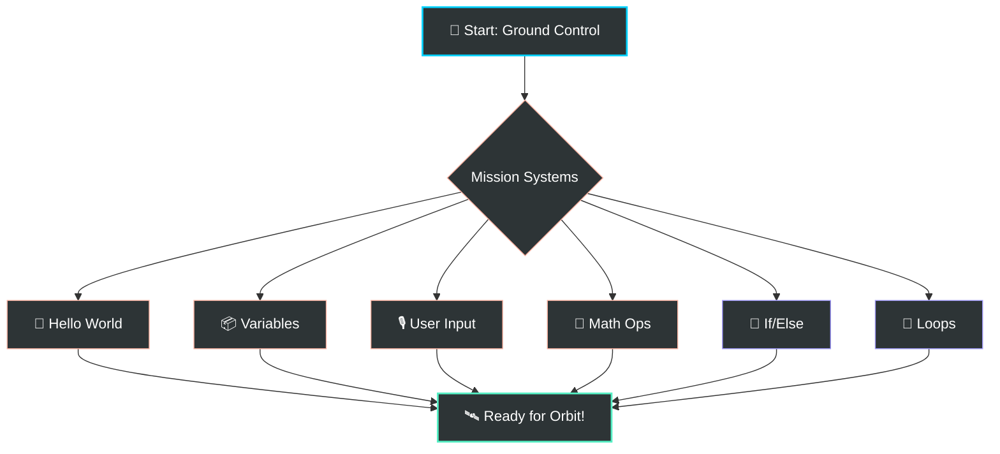

# 🚀 SECTION 1: THE CODER'S LAUNCH PAD  
**Day 1 – Mission: Mars Preparation**

---

## 👨‍🚀 Welcome, Future Space Engineer!
Today, you aren't just learning to "type code." You are preparing for a mission to the Red Planet. Every line of code you write is a command sent to your spaceship, a instruction for your rover, or a calculation for your landing trajectory.

> [!IMPORTANT]
> **NO INSTALLATION REQUIRED!**
> We will use the **Online Python Editor**: [Launch Editor Now 🛰️](https://www.online-python.com/)
> Open the editor, paste your mission files, and hit "Run" to see the magic happen!

---

## 🗺️ Mission Roadmap: The 6 Building Blocks
To reach Mars, you must master these six essential systems. Mastery of these ensures you can handle any solar flare or navigation error.

---

## 🛠️ Your Mission Toolkit

> [!NOTE]
> ### 1. Your First Program – Hello World
> **Analogy:** Testing your radio link. "Houston, can you hear us?"
> **Task:** Send your first message to Earth using the `print()` command.

> [!TIP]
> ### 2. Variables – Memory Boxes
> **Analogy:** Labeled cargo pods. One for "Fuel," one for "Oxygen," one for "Pilot Name."
> **Task:** Store information so your spaceship remembers it for later.

> [!IMPORTANT]
> ### 3. Getting Information from the User
> **Analogy:** Ground control sending you new coordinates or health stats.
> **Task:** Use `input()` to let humans talk to your program.

> [!WARNING]
> ### 4. Doing Math & Operations
> **Analogy:** Calculating if you have enough juice to reach the Moon and back.
> **Task:** Add, subtract, multiply, and divide numbers to solve space problems.

> [!CAUTION]
> ### 5. Making Decisions – if / else
> **Analogy:** The Rover's autopilot. If there's a crater --> Stop. Else --> Keep driving.
> **Task:** Teach your code to "think" and make choices based on data.

> [!NOTE]
> ### 6. Repeating Things – Loops
> **Analogy:** A satellite orbiting Earth 1,000 times to map the surface.
> **Task:** Make the computer repeat boring tasks instantly so you don't have to!

---

## 🗒️ Mission Checklist
*Put an [x] in the box when you complete a section!*

- [ ] `01_hello_world.py` - Radio Link Established
- [ ] `02_variables.py` - Cargo Pods Loaded
- [ ] `03_user_input.py` - Communications Open
- [ ] `04_math_operations.py` - Navigational Math Ready
- [ ] `05_if_else.py` - Autopilot Thinking
- [ ] `06_loops.py` - Continuous Scanning Active

---
**Ready to begin? Open `01_hello_world.py` and let's launch! 🚀✨**