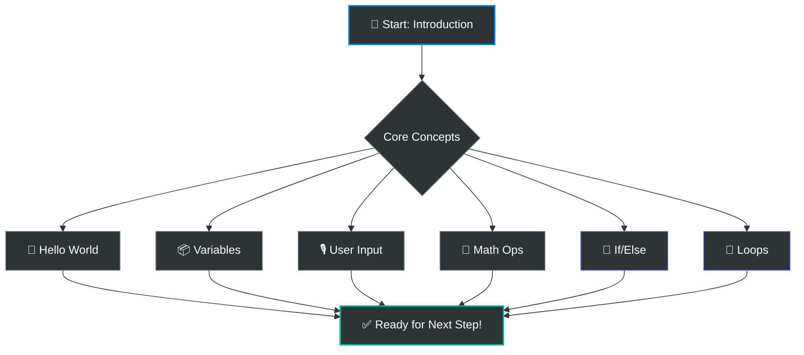

# 💻 SECTION 1: GETTING STARTED WITH CODING  
**Day 1 – The Fundamentals**

---

## 👋 Welcome to Your First Coding Session!
Today, you will learn the fundamental building blocks used by software developers to build everything from mobile apps to sophisticated websites. Coding is simply the art of giving instructions to a computer to solve problems.

> [!IMPORTANT]
> **NO INSTALLATION REQUIRED!**
> We will use the **Online Python Editor**: [Launch Editor Now 🚀](https://www.online-python.com/)
> Open the editor, paste your code, and hit "Run" to see it in action!

---

## 🗺️ Learning Roadmap: The 6 Building Blocks
These six concepts are the core of almost every programming language in the world. Once you master these, you can build almost anything.

---

## 🛠️ Your Coding Toolkit

> [!NOTE]
> ### 1. Your First Program – Hello World
> **Concept:** Displaying information on the screen.
> **Task:** Use the `print()` command to send your first message to the world.

> [!TIP]
> ### 2. Variables – Memory Boxes
> **Concept:** Storing information for later use.
> **Task:** Learn how to "save" data like names and numbers so your program remembers them.

> [!IMPORTANT]
> ### 3. Getting Information (User Input)
> **Concept:** Making programs interactive.
> **Task:** Use `input()` to allow users to type information into your program.

> [!WARNING]
> ### 4. Doing Math & Operations
> **Concept:** Using the computer as a calculator.
> **Task:** Use symbols like `+`, `-`, `*`, and `/` to perform calculations automatically.

> [!CAUTION]
> ### 5. Making Decisions – if / else
> **Concept:** Conditional logic.
> **Task:** Teach your program to do different things based on different conditions (e.g., "If score is high, say Great Job").

> [!NOTE]
> ### 6. Repeating Things – Loops
> **Concept:** Automating repetitive tasks.
> **Task:** Use loops to run the same piece of code multiple times without rewriting it.

---

## 🗒️ Progress Checklist
*Mark these off as you complete each file:*

- [ ] `01_hello_world.py` - First message displayed
- [ ] `02_variables.py` - Saving data successfully
- [ ] `03_user_input.py` - Interactive program built
- [ ] `04_math_operations.py` - Calculations completed
- [ ] `05_if_else.py` - Logic and decisions added
- [ ] `06_loops.py` - Repetitive tasks automated

---
**Ready to begin? Open `01_hello_world.py` and let's get started! 💻✨**
