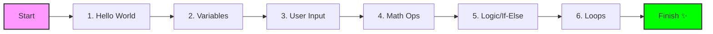

# 👋 Welcome to Your First Coding Session!

**Wait, what exactly is coding?**  
Think of coding like writing a very simple **recipe** or giving **directions** to a friend. You are just giving the computer a list of clear steps to follow so it can do something for you—like doing math, showing a message on the screen, or even building a game!

Today, you will learn how to speak the computer's language (e.g. Python) to tell it exactly what to do.

---

**Current Location:** You are here, ready to code!

---

## 🛠️ Prerequisites
Before we dive in, ensure you have:

1. **Stable Internet Connection** to access the online editor.
2. **A Curious Mind**: There are no "dumb" questions here!

---

## 🗺️ Learning Roadmap
Today we are mastering the 6 building blocks used to build everything you use on a computer or phone.

---

## 🎙️ What are we building today?
We'll start with a simple "Hello" and end with a program that can make decisions and repeat tasks automatically. By the end of this session, you'll have 7 coding files that you can keep and run anytime.

> [!TIP]
> **Need help?** Just raise your hand! We are here to help you get your first "Success" message on the screen.

---

## 🚀 Get Started in 3 Simple Steps

To make this session as smooth as possible, we will use an online environment. No complex software installation is needed on your computer!

> [!IMPORTANT]
> **How to get your code:** 
> This page is your **Home Base**. For every lesson, you will come back here to get your code. You can find all the lessons in the **left side panel**. Just **click** a file name to see the code, then **copy** and **paste** it into your editor! You can also **download** the files to keep them forever.

### 1. Download Your First File
To start, you need the first piece of code on your machine. Click the large button below to save it.

> [!TIP]
> **[Download 01_hello_world.py 📥](session1/sectional%20codes/01_hello_world.py)**  
> *If the download doesn't start, right-click the link and select "Save Link As..."*

### 2. Open your Coding Dashboard
Click the button below to open the online editor in a new tab. You will use this to run your code throughout the session.

> [!IMPORTANT]
> **[Open Online Python Editor 🚀](https://www.programiz.com/python-programming/online-compiler/)**  
> *(Opens in a new tab)*

### 3. Let's Start Coding!
Go back to the **Online Editor** tab, copy the code from the downloaded file (or just type it in), and hit **"Run"**. I will explain every line as we go!

---

## ❓ Common Challenges for Beginners
- **"I can't find my downloaded file!"** Check your "Downloads" folder. On most computers, it's the default place for everything you download from the internet.
- **"How do I copy the code?"** Click the **01_hello_world.py** file in the sidebar on the left. You'll see the code there with a **"Copy"** button. Click it, then paste it into the editor!
- **"The editor is showing an error!"** Don't worry, errors are just the computer's way of asking for clarification. We will fix them together!

---

## 🗒️ Progress Checklist
*Mark these off as you complete each file:*

- [ ] `01_hello_world.py` - First message displayed
- [ ] `02_variables.py` - Saving data successfully
- [ ] `03_user_input.py` - Interactive program built
- [ ] `04_math_operations.py` - Calculations completed
- [ ] `05_if_else.py` - Logic and decisions added
- [ ] `06_loops.py` - Repetitive tasks automated

---
**Ready? Click on "Session 1: Basics" titles again if you ever need to return to these instructions! 💻✨**
