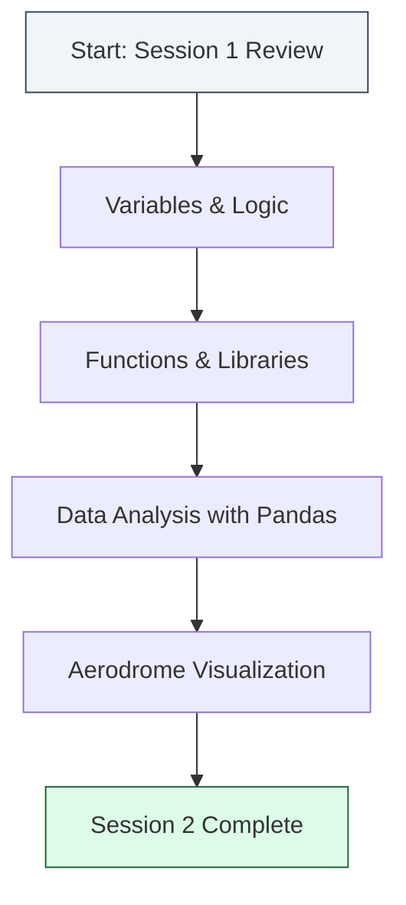

# Welcome to Session 2: Python Takeoff

Today we take the building blocks of code you learned in Session 1 and apply them to the world of **Aeronautics and Space Engineering**. You will learn how engineers at NASA, SpaceX, and the Kenya Airports Authority use Python to analyze flight data and manage complex systems.

---

## Learning Objectives
By the end of this session, you will be able to:
1. Handle different **Data Types** used in engineering (Strings, Integers, Floats, Booleans).
2. Perform complex **Arithmetic Operations** for unit conversions (Knots to KM/H, Fuel Weight).
3. Use **Control Flow** (If/Else, Loops) to simulate aircraft systems.
4. Write reusable **Functions** for recurring calculations.
5. Use **Pandas** to analyze real-world dataset of Kenyan Aerodromes.

---

## Engineering Roadmap

---

## What are we building today?
We are moving from simple scripts to a data-driven approach. We will start with a simulation of an aircraft descent and end by processing a geographic dataset of every major airport in Kenya to find high-altitude airfields.

> [!TIP]
> **Real World context:**  
> Python is the standard language for telemetry analysis. Every packet of data coming from a satellite or a test flight is processed using the same libraries (Pandas, NumPy) you are using today.

---

## Progress Checklist
*Mark these off as you complete the sections in your notebook:*

- [ ] **Part 1.1 - 1.3**: Variables & Basic Math (Unit Conversions)
- [ ] **Part 1.4 - 1.5**: Lists & Dictionaries (Airport Data)
- [ ] **Part 1.6 - 1.8**: Logic & Loops (Descent Simulation)
- [ ] **Part 1.9**: Reusable Functions
- [ ] **Part 2.1 - 2.2**: Importing Libraries & Loading AIP Data
- [ ] **Part 2.3**: Data Analysis with Pandas
- [ ] **Part 2.4**: Visualizing the Skies with Matplotlib

---
**Ready to launch? Open your Jupyter Notebook and let's begin!**
