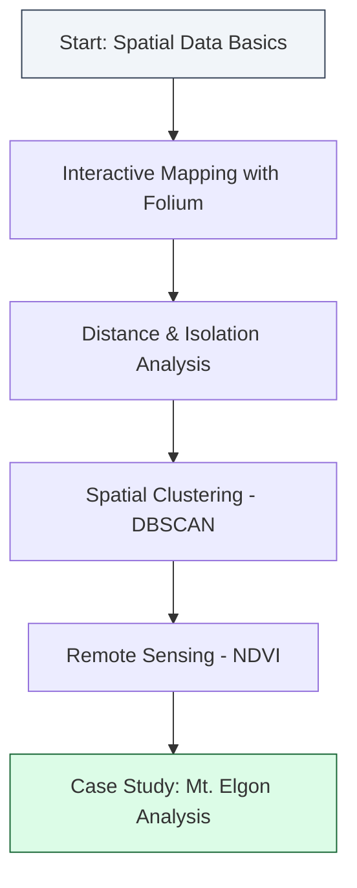

# Welcome to Session 3: Python Bridges to GIS

In this session, we transition from analyzing tables to visualizing the world. We will learn how to bridge Python with **Geographic Information Systems (GIS)** and **Remote Sensing** to analyze satellite imagery and spatial relationships.

---

## Learning Objectives
By the end of this session, you will be able to:
1. Understand the difference between **Vector** (points/lines) and **Raster** (pixels/images) data.
2. Build **Interactive Maps** using Folium that users can explore in a browser.
3. Perform **Spatial Analysis** like nearest neighbor searches and distance calculations.
4. Use **Machine Learning (DBSCAN)** to identify spatial clusters of infrastructure.
5. Process **Satellite Imagery** using Rasterio to calculate vegetation health (NDVI).

---

## Spatial Roadmap

---

## What are we bridging today?
GIS professionals traditionally use desktop software. Today, you will learn the "Python Bridge" — powerful code that allows you to automate these tasks at scale. We will conclude with a real-world case study analyzing the vegetation health of **Mt. Elgon** using Landsat data.

> [!IMPORTANT]
> **Technical Note:**  
> This session bridges theory with practice. While our team covers the foundations of GIS, this notebook demonstrates how a Data Engineer uses Python to actually solve spatial problems for agencies like the Kenya Space Agency.

---

## Progress Checklist
*Mark these off as you complete the sections in your notebook:*

- [ ] **Part 1**: From Python to Spatial Data (GeoJSON Structure)
- [ ] **Part 2**: Interactive Maps with Folium (Markers & Legend)
- [ ] **Part 3**: Nearest Neighbor & Distance Analysis
- [ ] **Part 4**: Spatial Clustering with DBSCAN (ML)
- [ ] **Part 5**: Intro to Remote Sensing & Satellite Bands
- [ ] **Part 5.4**: Calculating NDVI (Vegetation Health)
- [ ] **Part 6**: Coordinate Reference Systems (CRS)

---
**Ready to explore? Open your GIS notebook and let's map it out!**
